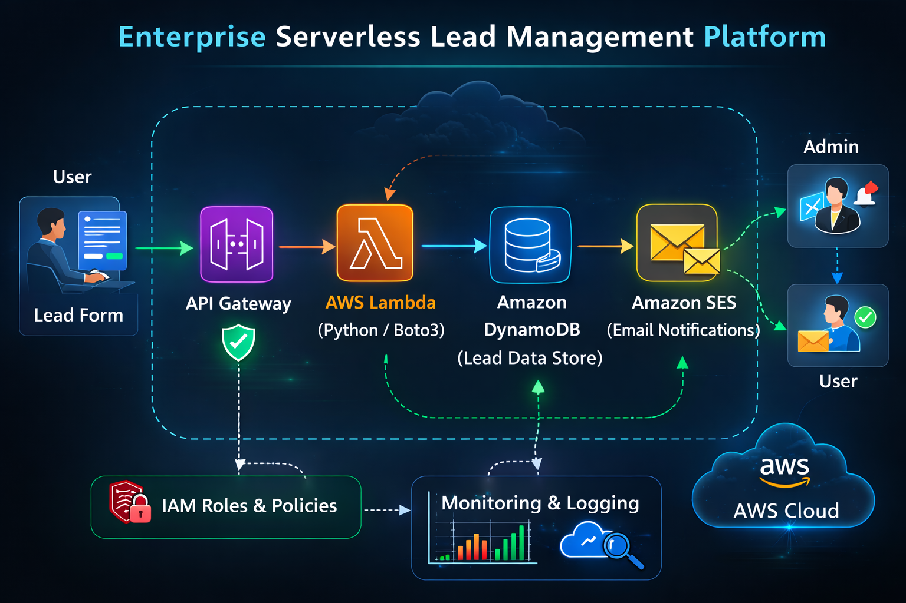

# 🌐 Enterprise Serverless Lead Management Platform

## 📋 Project Overview
This project demonstrates a fully serverless lead management system built on AWS. The system securely collects user data from a web form, processes it using serverless compute, stores it in a managed NoSQL database, and sends automated email notifications — all without managing servers. 

## 🎥 Project Demonstration
Watch the full implementation and serverless data flow here:  
**[▶️ Watch Project Video on My Portfolio](https://d2wzfn8f9c4zw5.cloudfront.net/project-03.html)** 

**Project Context:** Enterprise Serverless Backend Automation  
**Timeline:** 5 Weeks (API Design & Data Flow)  
**Environment:** Fully Managed Serverless Architecture  
**Core Tech Stack:** AWS Lambda, API Gateway, Amazon DynamoDB, Python, Amazon SES, IAM  

## 🎯 Objectives
- Build a scalable serverless backend architecture.
- Securely handle form submissions via API.
- Store structured lead data efficiently in a NoSQL database.
- Trigger automated email notifications upon data entry.
- Implement proactive monitoring and error handling.
- Follow real-world cloud security best practices.

## 🌍 Environment Details
- ☁️ **Cloud Provider:** AWS
- ☁️ **Architecture Type:** Fully Serverless
- ☁️ **Region:** Multi-AZ Deployment (Managed)
- ☁️ **Runtime:** Python
- ☁️ **Access Model:** REST API over HTTPS

## 🏗️ Architecture Diagram

## 🧱 Architecture Components
- 🏗️ **API Gateway:**
  - Exposes a secure REST API endpoint
  - Receives form submission requests
  - Enforces HTTPS communication
  - Integrates directly with AWS Lambda
- 🏗️ **AWS Lambda:**
  - Python-based serverless compute
  - Processes incoming lead data and validates request payload
  - Interacts seamlessly with DynamoDB and SES
  - Scales automatically based on incoming traffic
- 🏗️ **Amazon DynamoDB:**
  - Fully managed NoSQL database
  - Stores structured lead information
  - High availability across AZs with low latency performance
- 🏗️ **Amazon SES (Simple Email Service):**
  - Sends automated email notifications
  - Confirms successful form submission to the user
  - Notifies administrators of new leads
- 🏗️ **IAM Roles & Policies:**
  - Enforces least privilege access control
  - Ensures secure service-to-service communication

## 🔁 Traffic Flow
1. **User Action:** User submits a lead form from the website.
2. **API Call:** HTTPS request is sent to the API Gateway.
3. **Processing Trigger:** API Gateway seamlessly triggers the Lambda function.
4. **Validation:** Lambda validates and processes the incoming data.
5. **Storage:** Data is stored securely in Amazon DynamoDB.
6. **Notification:** SES sends confirmation and admin notification emails.
7. **Monitoring:** Monitoring logs are generated automatically in CloudWatch.

## 🔐 Security & Best Practices Implemented
- 🛡️ HTTPS-only REST API access.
- 🛡️ IAM least-privilege permissions strictly enforced.
- 🛡️ No servers exposed to the internet (Fully Serverless).
- 🛡️ Secure data handling and processing inside Lambda.
- 🛡️ Cloud-based logging and monitoring via CloudWatch.
- 🛡️ High availability achieved through AWS managed services.

## 🧪 Validation & Testing
- [x] Tested API endpoints securely using Postman.
- [x] Verified successful data storage inside DynamoDB.
- [x] Confirmed automated email delivery via SES.
- [x] Checked Lambda execution and error logs in CloudWatch.
- [x] Performed multiple submission tests to ensure reliability.

## 💡 Key Learnings & Why This Project Matters
Through this project, I gained hands-on experience building fully serverless applications, designing REST APIs, implementing secure service integrations, and managing cloud-based databases. I also strengthened my understanding of event-driven architecture, IAM security policies, and automated notification systems in AWS.

This project demonstrates modern serverless architecture principles, secure API development, automation, and scalable backend design — skills highly relevant and demanded for real-world Cloud and DevOps engineering roles.
